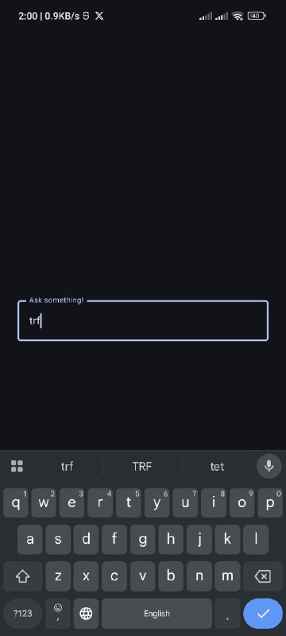
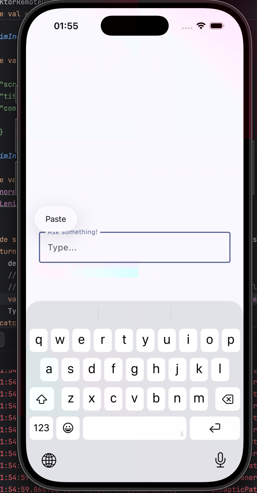
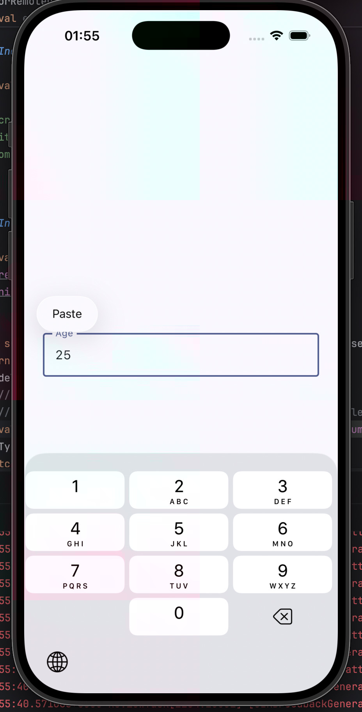
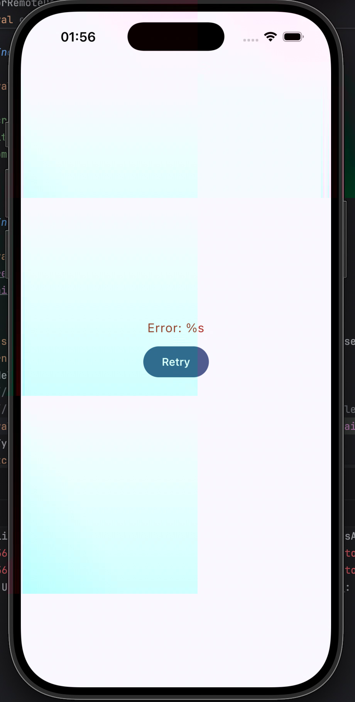

# ReviewTask

## Project Objective

This project is a Kotlin Multiplatform application designed to dynamically render a single mobile input component based on a REST API response. The core goal was to demonstrate proficiency in Kotlin Multiplatform architecture, REST API integration, serialization, dynamic UI rendering, state management, and persistence across configuration changes.

## How to Run the Project

### Prerequisites

*   Android Studio Jellyfish | 2023.3.1 or newer
*   JDK 17 or newer
*   A physical Android device or emulator running API level 21 or higher

### Running on Android

1.  **Clone the repository:**
    ```bash
    git clone https://github.com/yourusername/ReviewTask.git
    cd ReviewTask
    ```
2.  **Open in Android Studio:**
    Open the `ReviewTask` project in Android Studio.
3.  **Sync Gradle:**
    Allow Android Studio to sync the Gradle project. If it doesn't happen automatically, click the "Sync Project with Gradle Files" button in the toolbar.
4.  **Run the `androidApp`:**
    Select the `androidApp` run configuration and choose your desired emulator or connected device. Click the "Run" button (green triangle icon) to deploy and run the application.

## Architecture Decisions

The project follows a modular and layered architecture, typical for Kotlin Multiplatform projects, to ensure a clear separation of concerns and maintainability.

*   **Kotlin Multiplatform (KMP):** The core logic, including data models, API interfaces, and business logic, is shared across common modules.
*   **Compose Multiplatform:** The UI is built using Jetpack Compose, enabling a declarative and reactive approach to UI development for Android.
*   **Ktor Client:** Used for making network requests to the REST API, providing a robust and flexible HTTP client.
*   **Kotlinx Serialization:** Employed for type-safe serialization and deserialization of JSON responses into Kotlin data models (`ComponentResponseDto`).
*   **Repository Pattern:** A `RemoteDataSource` interface abstracts the data fetching logic, allowing for easy switching between a real API and a fake/mock implementation. This enhances testability and development flexibility.
*   **ViewModel with SavedStateHandle:** State management is handled by `ViewModel`s, utilizing `SavedStateHandle` for persistence across configuration changes (like screen rotations), ensuring the UI state is preserved without needing long-term storage.

## Assumptions Made

*   The backend will always return a single UI component definition in the `/screen/home` endpoint response.
*   The `type` field in the component JSON response will always correspond to one of the supported component types (`text`, `number`, `slider`, `empty_box`).
*   The `id`, `label`, and `placeholder` (for text/number) or `min`, `max`, `value` (for slider) fields will always be present and correctly typed for their respective component types.
*   The app's UI is designed for mobile form factors (Android primarily, with potential for iOS).
*   For this task, a fake remote data source (`FakeKtorRemoteDataSource`) is used to simulate API responses with hardcoded JSON data.

## What is Implemented

*   **Dynamic UI Rendering:** The app fetches a JSON response defining a UI component and renders it dynamically on the screen.
*   **Supported Component Types:**
    *   **Text Field:** Renders a text input field with a label and placeholder.
    *   **Number Input:** Renders a number input field with a label and placeholder.
    *   **Slider:** Renders a slider with a label, min, max, and current value.
    *   **Empty Box:** Renders a box with a color specified in the response.
*   **State Management & Persistence:** The state of the rendered component (e.g., text in a text field, value of a slider) is managed using `ViewModel` and persisted across configuration changes (like screen rotations) via `SavedStateHandle`.
*   **Loading, Success, and Error States:** The UI gracefully handles different states of the data fetching process, displaying loading indicators, the rendered component on success, and an error message on failure.
*   **Serialization:** Uses `kotlinx.serialization` to parse JSON responses into type-safe Kotlin data models (`ComponentResponseDto`).
*   **KMP Shared Module:** Core data models, API interfaces, and business logic reside in the `shared` module, accessible by platform-specific modules.
*   **Fake Remote Data Source:** A `FakeKtorRemoteDataSource` is implemented to provide mock API responses, facilitating development without a live backend.

## What is Not Implemented

*   **iOS Target Support:** While the project uses Kotlin Multiplatform, an iOS target has not been implemented at this stage.
*   **Retry Button on Error:** The error state currently displays a message, but a "Retry" button to re-fetch data is not yet implemented.
*   **Pull-to-Refresh:** The functionality to pull down to refresh the component is not implemented.
*   **Input Validation:** No explicit validation rules are applied to user inputs (e.g., ensuring number input is indeed a number within a range).
*   **Theming (Material Design 3 advanced features):** Basic theming is present, but advanced Material Design 3 features or custom theming beyond the default setup are not extensively implemented.
*   **Persistence Beyond Configuration Changes:** Component state is not persisted when the application is closed or in the background.
*   **Unit Tests:** Unit tests for the data layer, domain logic, or UI components are not yet included.

## Screenshots / Screen Recording

## Android ScreenShots
|  |  |  |
|-----------------------------------------------|-----------------------------------------------|-----------------------------------------------|

## IOS ScreenShots
|  |  |  |
|--------------------------------|--------------------------------|--------------------------------|

## Demo video
[Watch Demo](./video_demo.mp4)

---
